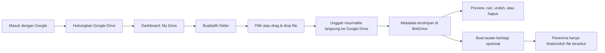

# PRD — BrikDrive

> Cloud drive pribadi untuk menyimpan, menemukan, melihat, dan membagikan foto serta video di **Google Drive milik pengguna**.

| Item | Nilai |
| --- | --- |
| Status | Draft v1.1 — storage direvisi dari Cloudflare R2 ke Google Drive |
| Platform | Web responsif; desktop lebih dahulu, nyaman di mobile |
| Stack target | Next.js + TypeScript + Tailwind, Supabase, Google Drive API, Vercel |
| Batas file aplikasi | Maksimum 5 GiB per file |
| Pengguna V1 | Drive pribadi; model data mendukung satu koneksi Google Drive per akun di masa depan |

## 1. Masalah dan tujuan

Foto serta video pribadi mudah tersebar antara perangkat, chat, dan layanan publik. BrikDrive memberi satu antarmuka privat untuk mengunggah file besar ke Google Drive pengguna, menyusunnya ke folder, melihat pratinjau, dan membagikan file tertentu secara terkendali.

### Tujuan V1

- Pengguna masuk memakai Google, lalu menghubungkan Google Drive yang akan menjadi lokasi penyimpanan.
- Pengguna hanya melihat metadata dan file miliknya sendiri di BrikDrive.
- Pengguna dapat membuat folder, mengunggah foto/video hingga 5 GiB, mencari, melihat, mengunduh, dan memindahkan file ke sampah.
- Upload besar berjalan dari browser langsung ke sesi resumable Google Drive; Vercel tidak menerima byte media asli.
- Tautan berbagi selalu opt-in, hanya untuk satu file, hanya baca/unduh, dapat dicabut, dan dapat dijadwalkan kedaluwarsa oleh BrikDrive.
- Pengalaman visual terasa tegas, hangat, dan mudah dipindai melalui gaya **neobrutalism**.

### Bukan ruang lingkup V1

- Sinkronisasi otomatis perangkat atau aplikasi native.
- Kolaborasi/editing, berbagi folder, komentar, atau izin tulis.
- Pembayaran, kuota berbayar, AI tagging, OCR, antivirus, maupun transcoding video.
- Mengimpor atau mengelola seluruh isi Google Drive pengguna di luar folder yang dibuat aplikasi.

## 2. Pengguna dan kebutuhan utama

| Persona | Kebutuhan | Hasil yang diharapkan |
| --- | --- | --- |
| Pemilik arsip pribadi | Menyimpan foto/video dari banyak perangkat | Media masuk ke Google Drive miliknya, terorganisasi, dan mudah ditemukan |
| Pengguna yang ingin berbagi | Mengirim satu foto/video tanpa membuka seluruh drive | Link mudah disalin dan dapat dimatikan dari BrikDrive |
| Pengguna dengan koneksi tidak stabil | Mengunggah video besar | Progress per file dan upload dapat diteruskan selama sesi Google Drive masih berlaku |

## 3. Alur produk

## 4. Kebutuhan fungsional

### 4.1 Autentikasi dan koneksi Drive

- Halaman awal menampilkan CTA **“Masuk dengan Google”**. Supabase Auth mengelola sesi aplikasi dan callback ke `/drive`.
- Saat penggunaan pertama, pengguna menyelesaikan langkah **“Hubungkan Google Drive”**. Aplikasi meminta izin minimal `drive.file`, sehingga aplikasi mengelola file/folder yang dibuatnya sendiri, bukan seluruh Drive pengguna.
- Koneksi Drive dapat memakai akun Google yang sama dengan login atau akun Google lain yang dipilih pengguna. UI selalu menampilkan email Drive yang terhubung.
- Pengguna dapat memutus koneksi Drive. Setelah diputus, upload dan akses media dihentikan sampai koneksi baru dibuat; metadata BrikDrive tetap ada agar pengguna dapat menghubungkan kembali akun yang benar atau meminta pembersihan.
- Semua halaman drive dan API privat menolak permintaan tanpa sesi dengan `401` dan mengarahkan UI ke login.

### 4.2 Drive dan folder

- Dashboard menunjukkan breadcrumb, folder pada lokasi aktif, file pada lokasi aktif, serta ringkasan pemakaian BrikDrive.
- Saat koneksi dibuat, aplikasi membuat folder akar bernama `BrikDrive` di Google Drive pengguna. Folder dan file yang dikelola aplikasi disimpan di bawah akar ini; BrikDrive menyimpan pasangan ID folder lokal dan Google Drive.
- Pengguna dapat membuat, mengganti nama, membuka, dan memindahkan folder. Nama folder wajib 1–120 karakter setelah trim.
- Folder dapat berada di root BrikDrive atau di dalam folder lain. Parent wajib milik pengguna yang sama dan harus terpetakan ke folder Google Drive aktif.
- Penghapusan folder V1 hanya diizinkan bila tidak memiliki folder/file aktif; UI menjelaskan alasan jika ditolak.
- Tampilan file mendukung grid galeri dan list, beserta pengurutan nama, tanggal unggah, dan ukuran.

### 4.3 Upload foto dan video

- Area upload mendukung klik, drag-and-drop, dan pemilih banyak file.
- Tipe yang diterima: `image/*` dan `video/*`; aplikasi memvalidasi nama, MIME yang diklaim, ekstensi, ukuran maksimum 5 GiB, folder, dan ketersediaan pemakaian sebelum membuat sesi Drive.
- Upload memakai Google Drive resumable upload untuk semua file agar satu alur konsisten dan dapat dilanjutkan. Browser mengirim chunk langsung ke endpoint upload Google Drive dengan `Content-Range`.
- UI menampilkan antrian, persen, ukuran terunggah, status (menunggu/mengunggah/terputus/dapat diteruskan/gagal/selesai), serta aksi batal/coba lagi.
- Browser menyimpan identitas sesi upload dan fingerprint file secara lokal. Saat jaringan pulih atau halaman dibuka lagi, aplikasi menanyakan byte terakhir yang diterima Google Drive, lalu melanjutkan dari byte berikutnya.
- Sesi resumable Google Drive berlaku terbatas (dirancang maksimum satu minggu); bila kedaluwarsa, UI meminta pengguna memulai ulang upload tanpa menghapus file lokal.
- Setelah Google Drive mengonfirmasi upload selesai dan server memverifikasi metadata provider, file muncul pada daftar aktif dan pemakaian BrikDrive diperbarui.

### 4.4 Preview dan metadata

- Foto yang didukung browser memakai thumbnail; klik membuka viewer dengan zoom dasar, nama, tipe, ukuran, tanggal, folder, tombol unduh, hapus, dan bagikan.
- Video yang didukung browser memakai poster/thumbnail dan `<video controls>` melalui akses baca Google Drive yang sudah diotorisasi.
- Untuk format yang browser tidak dapat pratinjau, kartu memakai ikon jenis file yang jelas dan tetap dapat diunduh.
- Untuk format kompatibel, browser membuat thumbnail berukuran terbatas dan mengunggahnya sebagai file pendamping privat di folder preview aplikasi. Jika thumbnail gagal atau tidak didukung, fallback ikon dipakai; kegagalan thumbnail tidak boleh menggagalkan original.
- BrikDrive menyimpan ID file Google Drive serta metadata yang diperlukan; nama asli ditampilkan aman dan tidak digunakan sebagai path provider.

### 4.5 Pencarian dan kapasitas

- Pencarian mencocokkan nama file secara case-insensitive pada file aktif milik pengguna, seluruh drive atau folder aktif sesuai konteks UI.
- Indikator utama menunjukkan **“pemakaian BrikDrive”** (jumlah file aktif yang dikelola aplikasi), bukan klaim seluruh pemakaian Google Drive akun.
- Jika Google Drive mengembalikan informasi storage quota yang dapat dibaca, UI boleh menampilkan kapasitas provider sebagai informasi terpisah. Upload tetap dapat gagal bila ruang Google Drive akun tidak mencukupi.
- File di sampah tidak muncul dalam hasil atau pemakaian aktif. Kebijakan retensi aplikasi default 30 hari dan dijelaskan saat penghapusan.

### 4.6 Unduh dan hapus

- Tombol unduh meminta tautan konten dari Google Drive setelah ownership diperiksa. Google Drive tetap mengevaluasi izin file sebelum mengirim byte.
- Hanya pemilik BrikDrive yang dapat menghapus. Aksi penghapusan adalah soft delete terlebih dahulu; file hilang dari drive aktif segera.
- Pembersihan berjalan asinkron: aplikasi mencabut izin share terkait, lalu menghapus original dan preview dari Google Drive. Proses idempoten dan dapat dicoba lagi tanpa membuka akses file.

### 4.7 Tautan berbagi dan batasan provider

- Tidak ada file yang dibagikan secara default.
- Pemilik dapat membuat tautan untuk satu file, menyalinnya, memilih waktu kedaluwarsa opsional, dan mencabutnya.
- Saat link publik aktif, BrikDrive membuat izin Google Drive `anyone: reader` yang tidak dapat ditemukan lewat pencarian. Hal ini diperlukan agar penerima tanpa login Google dapat membaca/mengunduh file.
- Ketika pemilik mencabut atau waktu kadaluwarsa tercapai, worker BrikDrive menghapus izin `anyone` dari Google Drive. Google Drive tidak menyediakan expiry native untuk izin `anyone`, sehingga keandalan cron/retry adalah bagian dari kontrak produk.
- Link BrikDrive memakai token acak berentropi tinggi dan database hanya menyimpan hash token. Namun, selama izin `anyone` masih aktif, URL Google Drive langsung yang diperoleh penerima juga dapat bekerja. Link BrikDrive **bukan** penghalang akses tambahan di atas ACL Google Drive.
- Link kedaluwarsa, dicabut, atau file dihapus memberi halaman “Link tidak tersedia” tanpa membocorkan identitas pemilik atau detail file. Pencabutan menghapus izin provider sehingga URL Google langsung juga tidak lagi dapat diakses.
- Untuk kebutuhan yang tidak boleh pernah menjadi “siapa pun yang memiliki link”, V1 harus memakai sharing berdasarkan email Google, bukan link publik.

## 5. Kontrak UI — Neobrutalism

Gaya visual harus terasa seperti papan kerja fisik yang tegas, bukan dashboard SaaS generik. Prioritasnya tetap keterbacaan dan aksesibilitas, bukan dekorasi.

| Elemen | Kontrak desain |
| --- | --- |
| Palet | Latar krem terang `#FFF9E8`, tinta hampir hitam `#171717`, kuning `#FFD84D`, pink `#FF7EB6`, biru `#73C7FF`, hijau `#A7E85A`; warna status tidak hanya dibedakan dengan warna. |
| Garis dan bayangan | Border hitam solid 3 px. Bayangan offset keras 6 px × 6 px, tanpa blur. Hover menggeser komponen 2 px ke kanan/bawah dan mengurangi offset bayangan; active menekan ke posisi bayangan. |
| Tipografi | Sans-serif yang padat untuk UI; judul memakai bobot 800–900 dan ukuran besar. Teks isi minimum 16 px pada layar kecil. |
| Komponen | Tombol, kartu file, panel, dialog, progress bar, menu, dan input selalu berbatas tebal dengan radius kecil (0–8 px), fokus terlihat jelas. |
| Layout | Header tebal, sidebar seperti blok kertas, area upload sebagai panel kuning kontras, kartu media berbentuk grid dengan label metadata. Spasi konsisten 8 px. |
| Media | Thumbnail proporsional (`object-fit: cover`); label tipe dan status overlay berkontras tinggi. Selalu tampilkan badge “Google Drive terhubung” di Settings, bukan pada setiap kartu. |
| Gerak | Maks. 150 ms, menghormati `prefers-reduced-motion`, dan tidak menjadi satu-satunya sinyal status. |

### Layar yang diperlukan

1. **Login** — satu kartu hero “Ruangmu. Aturanmu.”, penjelasan privasi singkat, tombol Google berbingkai tebal.
2. **Hubungkan Drive** — menjelaskan folder `BrikDrive`, izin minimal, email Drive terpilih, dan tombol connect/disconnect.
3. **My Drive** — header dengan upload/pencarian/profil; sidebar root dan folder; breadcrumb; indikator pemakaian; grid/list file.
4. **Folder kosong** — ilustrasi geometrik sederhana, CTA buat folder dan upload.
5. **Antrian upload** — panel tetap terlihat, progress berbasis teks dan bar, aksi lanjut/batal/retry; pesan eksplisit jika sesi upload Drive kedaluwarsa.
6. **Viewer** — modal/panel fokus untuk foto/video dengan kontrol keyboard, metadata, dan aksi pemilik.
7. **Bagikan** — dialog menunjukkan warning jelas bahwa “siapa pun yang memiliki link Google Drive dapat membuka file saat link aktif”, expiry aplikasi, salin, dan cabut.
8. **Public share** — halaman minimal tanpa navigasi drive; hanya viewer/unduh atau state link tidak tersedia.

### Aksesibilitas yang wajib

- Semua aksi dapat dijalankan keyboard; drag-drop selalu memiliki alternatif input file.
- Fokus keyboard kontras, tidak tertutup dialog, dan dikembalikan ke pemicu setelah dialog ditutup.
- Tombol ikon memiliki nama aksesibel; progress memakai `role="progressbar"` dan teks status.
- Kontras teks memenuhi WCAG AA; warna kuning/pink/biru tidak boleh dipakai sebagai satu-satunya indikator.
- Viewer memberi label untuk media dan mendukung Escape untuk tutup; video memiliki kontrol native.

## 6. Kebutuhan nonfungsional dan batasan

| Area | Target/aturan |
| --- | --- |
| Privasi | Semua file dibuat privat di folder Google Drive aplikasi. Link publik sementara menambah ACL `anyone: reader` hanya pada file yang dipilih. |
| Keamanan | Setiap API memverifikasi sesi dan kepemilikan; refresh token Drive terenkripsi server-side; URI sesi resumable diperlakukan sebagai rahasia sementara. |
| Skalabilitas | Next.js menyimpan metadata dan membuat sesi upload; browser mengirim byte media langsung ke Google Drive. |
| Ketahanan upload | Chunk 16 MiB (kelipatan 256 KiB), retry dengan exponential backoff terbatas, dan resume berdasarkan `Range` dari Google Drive. |
| Performa UI | Daftar file dipaginasi cursor; thumbnail dimuat lazy; media asli tidak dipakai sebagai thumbnail daftar. |
| Observabilitas | Semua error API memakai `requestId`, kode stabil, dan log terstruktur tanpa token OAuth, URI resumable, atau URL konten Drive. |
| Batas provider | Google Drive API mendukung file hingga 5 TB; batas aplikasi 5 GiB tetap berlaku. Akun Workspace memiliki batas upload provider yang perlu dipantau. |
| Browser | Chrome, Firefox, Safari, Edge versi modern. Format preview mengikuti dukungan browser. |

## 7. Metrik keberhasilan

- Pengguna berhasil menyelesaikan koneksi Google Drive dan upload foto/video kecil pada percobaan pertama.
- Video resumable sampai 5 GiB bisa diteruskan setelah gangguan jaringan yang disimulasikan.
- 100% permintaan lintas akun ke metadata, sesi upload, atau konten BrikDrive privat ditolak pada uji integrasi.
- Link dicabut/kedaluwarsa menghapus izin `anyone` Google Drive dan tidak dapat membuka halaman BrikDrive maupun URL konten provider.
- Kesalahan upload/API dapat ditelusuri melalui `requestId` tanpa menulis kredensial ke log.

## 8. Kriteria penerimaan rilis V1

- [ ] Google login, callback, logout, penjagaan rute, dan connect/disconnect Google Drive bekerja.
- [ ] Folder aplikasi dan pemetaan folder lokal ↔ Google Drive dibuat dengan benar.
- [ ] Folder, daftar file, search, grid/list, indikator pemakaian, preview, unduh, dan hapus bekerja untuk pemilik.
- [ ] Upload resumable foto, video kecil, dan video hingga 5 GiB dapat selesai serta dilanjutkan setelah koneksi putus.
- [ ] Byte media asli tidak melewati fungsi Vercel saat upload maupun preview/unduh normal.
- [ ] Tidak ada pengguna yang dapat membaca, mengunduh, menghapus, atau melanjutkan sesi upload pengguna lain.
- [ ] Link share membuat/mencabut ACL Google Drive yang tepat; expiry worker menghapus ACL `anyone` dan retry bila provider gagal.
- [ ] UI share secara eksplisit menjelaskan batasan URL Google Drive langsung saat link publik aktif.
- [ ] Type-check, lint, unit test API, dan E2E alur inti lulus sebelum deploy.
- [ ] Konfigurasi Google Cloud, Google Drive API, Supabase, Google OAuth, Vercel, domain, token encryption, dan environment variable terdokumentasi tanpa rahasia.

## 9. Keputusan terbuka sebelum implementasi produksi

- Apakah V1 hanya mengizinkan satu akun Drive owner yang ditetapkan, atau setiap akun BrikDrive dapat menghubungkan Drive-nya sendiri.
- Kuota aplikasi dan strategi penagihan bila nanti ada paket berbayar; kapasitas Google Drive tetap mengikuti paket akun provider.
- Durasi retensi file di sampah dan frekuensi worker pembersihan/revocation.
- Apakah public share harus tetap tersedia, atau V1 hanya memakai sharing ke alamat email Google untuk privasi yang lebih ketat.
- Perilaku saat pengguna memindahkan atau menghapus file langsung dari UI Google Drive.

## Referensi provider

- [Google Drive resumable uploads](https://developers.google.com/workspace/drive/api/guides/manage-uploads)
- [Google Drive scopes](https://developers.google.com/workspace/drive/api/guides/api-specific-auth)
- [Google Drive sharing dan expiry permission](https://developers.google.com/workspace/drive/api/guides/manage-sharing)
