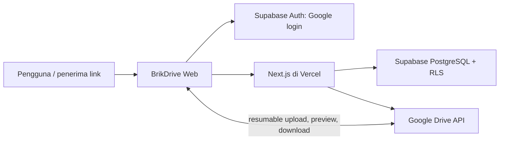
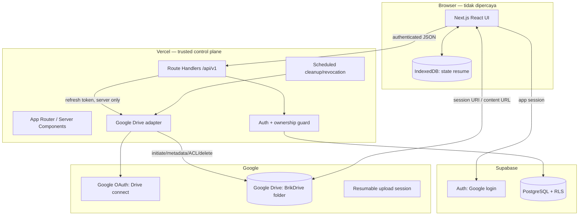
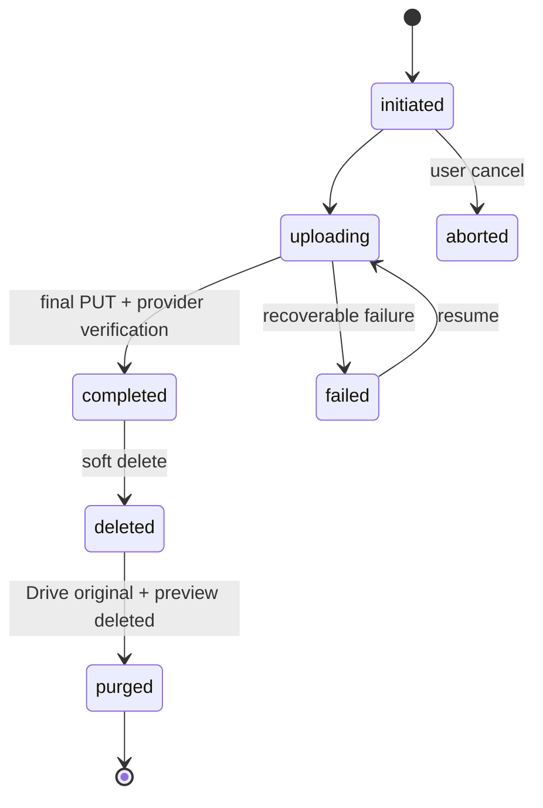

# System Design — BrikDrive

> Rancangan modular monolith untuk cloud drive pribadi: Next.js mengelola identitas, otorisasi, metadata, dan koneksi Google Drive; browser mengirim media langsung ke Google Drive melalui resumable upload.

| Item | Keputusan |
| --- | --- |
| Status | Draft v1.1 — storage provider Google Drive |
| Arsitektur | Modular monolith di Vercel + Supabase + Google Drive API |
| Data relasional | Supabase PostgreSQL dengan Row Level Security (RLS) |
| Identitas aplikasi | Supabase Auth dengan Google OAuth |
| Storage provider | Google Drive, folder aplikasi privat per koneksi |
| Kontrak API | REST JSON versi `/api/v1`, validasi Zod, error terstruktur |

## 1. Prinsip dan keputusan arsitektur

### Keputusan

Pilih **modular monolith**, bukan microservices. V1 memiliki satu domain utama (drive pribadi), satu tim, dan kebutuhan scaling terbesar ada pada jalur byte media. Jalur byte tersebut berjalan browser ↔ Google Drive; Vercel tetap menangani control plane yang ringan.

Pisahkan jalur **control plane** dari **data plane**:

- Control plane: Next.js API, Supabase Auth/Postgres, otorisasi, metadata, token connection Google Drive, audit, dan pembuatan sesi resumable.
- Data plane: browser ↔ endpoint resumable Google Drive untuk upload; browser ↔ tautan konten Google Drive untuk preview/unduh setelah ACL provider diperiksa.

Konsekuensinya, Vercel tidak pernah menerima payload media asli hingga 5 GiB. Server memegang refresh token Google Drive terenkripsi; browser hanya menerima URI sesi resumable sementara setelah ownership diverifikasi.

### Alternatif dan trade-off

| Alternatif | Keputusan / alasan |
| --- | --- |
| Proxy upload/download lewat Next.js/Vercel | Ditolak: menabrak batas body/timeout, mahal, dan tidak reliabel untuk video besar. |
| Cloudflare R2 private + signed URL | Digantikan atas pilihan produk. R2 tetap lebih cocok bila share link harus memakai URL baca berumur pendek yang tidak membuka ACL provider publik. |
| Google Drive direct resumable upload | Dipilih: mendukung file besar dan resume tanpa meneruskan media melalui Vercel. |
| Google Drive `anyone: reader` untuk share publik | Dipilih hanya untuk link opt-in. Tidak ada native expiry untuk `anyone`; aplikasi wajib mencabut permission dengan worker. |
| Microservices + queue sejak awal | Ditolak: menambah deployment dan failure mode tanpa boundary domain/team yang nyata. |

## 2. C4 ringkas

### Konteks



### Container dan batas kepercayaan



**Batas kepercayaan:**

- Login aplikasi dan koneksi Drive adalah dua consent berbeda. Login hanya membentuk sesi BrikDrive; connection meminta scope Drive `drive.file` dengan akses offline agar server dapat menjalankan cleanup/revocation.
- Refresh token, client secret, dan ciphertext URI sesi tidak pernah dikirim ke browser, muncul pada log, atau dapat dibaca langsung melalui RLS.
- URI upload resumable diperlakukan sebagai bearer capability sementara. API hanya mengembalikannya kepada owner sesi; browser menyimpannya terbatas di IndexedDB dan tidak mengirimkannya ke analytics/error reporting.
- Google Drive tetap menjadi penegak izin akhir terhadap tautan konten. BrikDrive tidak mengklaim memiliki signed URL object-level setara R2.

## 3. Modul aplikasi dan aturan dependensi

```text
src/
  app/                    # halaman, route handler, dan wiring framework
  modules/
    auth/                  # session + auth guard
    drive/                 # folder, file listing, search, app usage
    drive-connection/      # OAuth callback + credential lifecycle
    uploads/               # create/status/resume/complete/cancel
    sharing/               # link token + Drive ACL reader/revoke
    media/                 # content-link/preview + metadata sanitization
    cleanup/               # purge, stale session, expiry/revocation
  lib/
    db/                    # Supabase repositories
    google-drive/          # Google API adapter
    crypto/                # envelope encryption for provider secrets
    validation/            # Zod schemas
    observability/         # request ID dan structured logging
```

- Route handler hanya mengurai transport, meminta sesi, memvalidasi input, lalu memanggil use case.
- Use case mengatur otorisasi dan transaksi; tidak mengimpor `Request`/`Response` atau Google SDK.
- Adapter Google Drive adalah satu-satunya kode yang mengetahui API provider. Folder/file provider diidentifikasi oleh ID Google Drive yang dibuat aplikasi, bukan path atau nama input pengguna.
- Kegagalan provider dipetakan ke kode error aplikasi stabil: autentikasi koneksi, quota, session expired, conflict, atau dependency error.

## 4. Model data PostgreSQL

UUID adalah primary key. Semua waktu bertipe `timestamptz`. Google Drive IDs diperlakukan sebagai opaque string, tidak ditebak atau dibentuk dari nama file.

| Tabel | Kolom penting | Invarian / indeks |
| --- | --- | --- |
| `profiles` | `id` FK `auth.users`, `display_name`, `avatar_url`, `app_quota_bytes`, `created_at` | satu profil per user; user hanya membaca profil sendiri |
| `drive_connections` | `id`, `owner_id`, `google_email`, `root_folder_id`, `refresh_token_ciphertext`, `token_key_version`, `scopes`, `connected_at`, `revoked_at` | satu koneksi aktif/owner pada V1; token tidak dapat dibaca client/RLS |
| `folders` | `id`, `owner_id`, `drive_connection_id`, `parent_id`, `provider_folder_id`, `name`, `created_at`, `updated_at`, `deleted_at` | parent dan connection harus milik owner yang sama; unique partial nama folder aktif per parent |
| `files` | `id`, `owner_id`, `drive_connection_id`, `folder_id`, `original_name`, `normalized_name`, `mime_type`, `byte_size`, `provider_file_id`, `preview_provider_file_id`, `upload_status`, `completed_at`, `deleted_at`, `purge_after` | ukuran 1..5 GiB; `provider_file_id` unique saat terisi; indeks `(owner_id, folder_id, created_at desc)` dan pencarian nama aktif |
| `upload_sessions` | `id`, `file_id`, `owner_id`, `resumable_uri_ciphertext`, `chunk_size`, `confirmed_byte`, `status`, `expires_at`, `last_error_code`, `created_at` | satu sesi aktif/file; URI terenkripsi; owner harus sesuai file |
| `file_shares` | `id`, `file_id`, `owner_id`, `token_hash`, `drive_permission_id`, `expires_at`, `revoked_at`, `created_at` | token hash unique; permission provider dicatat untuk revocation; hanya file completed aktif yang boleh dibagikan |
| `deletion_jobs` | `id`, `file_id`, `provider_file_id`, `preview_provider_file_id`, `status`, `attempts`, `next_attempt_at`, `last_error_code` | unique job aktif per file; worker-only |
| `audit_events` | `id`, `actor_id`, `event_type`, `file_id`, `share_id`, `request_id`, `occurred_at`, `metadata` | metadata disanitasi; tidak menyimpan OAuth token, URI resumable, atau content link |

Gunakan enum `upload_status`: `initiated`, `uploading`, `completed`, `failed`, `aborted`, `deleted`. Query file aktif selalu memerlukan `upload_status = 'completed' AND deleted_at IS NULL`.

### RLS dan integritas

- Aktifkan RLS pada seluruh tabel aplikasi.
- `profiles`, `folders`, `files`, `upload_sessions`, dan `file_shares` memiliki policy akses pemilik, misalnya `owner_id = auth.uid()`.
- Tidak ada policy klien untuk `drive_connections`, `deletion_jobs`, atau `audit_events`. Service server mengaksesnya hanya setelah membuktikan owner dari request asal; data credential tidak pernah berada pada respons API.
- Trigger/constraint menolak folder parent lintas owner/connection serta share untuk file yang bukan milik owner atau belum completed.
- Function server untuk agregat pemakaian hanya menghitung file owner yang completed dan belum deleted. Nilai ini adalah pemakaian BrikDrive, bukan seluruh kuota Google Drive.

## 5. Upload resumable dan resume

### Parameter awal

- Batas aplikasi: **5 GiB** (`5 * 1024^3` bytes). Google Drive API mendukung file hingga 5 TB; batas aplikasi ini tetap dipaksakan server.
- `chunkSize` awal: 16 MiB, tepat kelipatan 256 KiB yang disyaratkan untuk chunk non-final Google Drive.
- Upload dijalankan serial per file agar respons `Range` menjadi sumber kebenaran sederhana. Antrean dapat memproses beberapa file dengan batas konkuren yang diuji (awal: 2).
- Server membuat UUID `fileId` dan mengirim metadata Drive: nama tersanitasi, MIME, parent folder provider, serta `appProperties.brikdriveFileId`. Nama pengguna bukan path storage.

### Urutan upload

```mermaid
sequenceDiagram
  participant B as Browser
  participant N as Next.js API
  participant D as Supabase DB
  participant G as Google Drive API

  B->>N: POST /uploads (name, MIME, byteSize, folderId, idempotency key)
  N->>D: verify owner/folder/connection/app quota; create file + session
  N->>G: files.create(uploadType=resumable, metadata)
  G-->>N: Location: resumable session URI
  N->>D: encrypt and store session URI
  N-->>B: uploadId, fileId, chunkSize, session URI
  B->>G: PUT Content-Range chunk 1..n directly
  G-->>B: 308 + Range until final chunk
  B->>G: final PUT Content-Range
  G-->>B: 200/201 + Drive file ID
  B->>N: POST /uploads/{id}/complete (providerFileId)
  N->>G: files.get + verify appProperties/parent/size/MIME
  N->>D: transaction: mark file/session completed, record audit
  N-->>B: completed file metadata
```

### Resume dan kegagalan

1. IndexedDB menyimpan `uploadSessionId`, fingerprint file (nama/ukuran/lastModified), ukuran chunk, dan byte terakhir yang diketahui—bukan refresh token Google.
2. Saat reload/retry, browser memanggil `GET /uploads/{id}`. Server memeriksa owner dan status, lalu mengembalikan URI sesi yang didekripsi hanya untuk sesi aktif.
3. Browser mengirim request status kosong ke URI Google Drive dengan `Content-Range: */{total}`. Respons `308 Resume Incomplete` serta header `Range` menentukan byte berikutnya. Browser tidak mengasumsikan chunk terakhir sukses.
4. Browser retry chunk yang gagal dengan exponential backoff + jitter dan batas percobaan. Respons 4xx validasi tidak di-retry; 5xx/jaringan boleh di-retry setelah query status.
5. Sesi Google Drive kedaluwarsa sekitar satu minggu. API memetakan kondisi ini ke `UPLOAD_EXPIRED` (410); UI menawarkan mulai ulang dari file lokal.
6. Completion hanya sukses setelah server membaca file provider memakai credential koneksi dan memverifikasi ID internal, folder parent, ukuran, MIME, dan bahwa file tidak berada di trash.
7. Cancel menghentikan browser, menandai sesi `aborted`, dan menghapus ciphertext URI dari aplikasi. Worker menyapu hasil upload yang selesai tetapi belum terikat atau file yang dibatalkan; sesi provider yang tidak selesai dibiarkan kedaluwarsa sesuai lifecycle Google Drive.

### Preview

Untuk format yang didukung, klien membuat preview WebP/JPEG maksimum 2 MiB dari file lokal. Server membuat sesi upload Drive kedua di folder preview privat; setelah selesai, endpoint `POST /uploads/{id}/preview-complete` memverifikasi file pendamping dan menyimpan `preview_provider_file_id`. Preview bersifat best-effort dan tidak mengubah status original. Untuk list, layanan media meminta link thumbnail/containing preview yang Google Drive izinkan; jika tidak ada, UI memakai fallback ikon.

## 6. Kontrak API v1

Semua endpoint privat mengharuskan session Supabase valid. Semua mutasi memakai `Content-Type: application/json`, validasi Zod, dan header opsional `Idempotency-Key` (UUID) untuk operasi yang dapat diulang.

| Endpoint | Akses | Tujuan |
| --- | --- | --- |
| `POST /api/v1/drive-connection/start` | owner | Memulai OAuth connection Google Drive dengan state/PKCE. |
| `GET /api/v1/drive-connection/callback` | owner callback | Menukar code, mengenkripsi refresh token, membuat root folder `BrikDrive`. |
| `GET, DELETE /api/v1/drive-connection` | owner | Membaca status koneksi aman atau memutus koneksi. |
| `GET /api/v1/storage/usage` | owner | Total byte aktif BrikDrive dan kuota aplikasi. |
| `GET, POST /api/v1/folders` | owner | Daftar folder berdasarkan `parentId`; buat folder lokal/provider. |
| `PATCH, DELETE /api/v1/folders/:folderId` | owner | Rename/move provider; hapus folder kosong. |
| `GET /api/v1/files` | owner | Daftar/pencarian cursor: `folderId`, `q`, `view`, `sort`, `cursor`, `limit`. |
| `GET /api/v1/files/:fileId` | owner | Detail metadata aman untuk UI. |
| `DELETE /api/v1/files/:fileId` | owner | Soft delete + antrekan revoke/purge. |
| `POST /api/v1/files/:fileId/download` | owner | Meminta link content Google Drive setelah ownership check. |
| `POST /api/v1/files/:fileId/preview` | owner | Meminta link preview/content setelah ownership check. |
| `POST /api/v1/uploads` | owner | Inisiasi resumable Google Drive dan kembalikan URI sesi. |
| `GET /api/v1/uploads/:uploadId` | owner | Status resume dan URI sesi aktif. |
| `POST /api/v1/uploads/:uploadId/progress` | owner | Catat `confirmedByte` dari `Range`; opsional untuk UI observability. |
| `POST /api/v1/uploads/:uploadId/complete` | owner | Verifikasi `providerFileId` di Google Drive lalu selesaikan metadata. |
| `POST /api/v1/uploads/:uploadId/cancel` | owner | Batalkan dari sisi aplikasi dan antrekan sweep provider. |
| `POST /api/v1/uploads/:uploadId/preview-complete` | owner | Konfirmasi preview best-effort. |
| `GET, POST /api/v1/files/:fileId/shares` | owner | Daftar dan buat link + permission Google Drive `anyone: reader`. |
| `POST /api/v1/shares/:shareId/revoke` | owner | Hapus permission Google Drive dan cabut link. |
| `GET /api/v1/public/shares/:token` | public token | Validasi token/expiry lalu metadata aman + target content provider. |
| `POST /api/v1/public/shares/:token/download` | public token | Validasi token lalu mengarahkan ke content link Google Drive; read-only. |

Contoh amplop error:

```json
{
  "error": {
    "code": "FORBIDDEN",
    "message": "Anda tidak memiliki akses ke file ini.",
    "requestId": "01J..."
  }
}
```

Kode minimum: `UNAUTHENTICATED` (401), `FORBIDDEN` (403), `NOT_FOUND` (404 tanpa mengonfirmasi objek lintas user), `VALIDATION_ERROR` (400), `CONFLICT` (409), `QUOTA_EXCEEDED` (409), `DRIVE_NOT_CONNECTED` (409), `UPLOAD_EXPIRED` (410), `RATE_LIMITED` (429), dan `DEPENDENCY_ERROR` (503).

## 7. Otorisasi dan keamanan

### Keputusan otorisasi

1. Ambil user dari cookie/JWT Supabase yang tervalidasi server-side; **jangan** menerima `ownerId` dari request sebagai dasar akses.
2. Untuk setiap `fileId`, `folderId`, `uploadId`, atau `shareId`, query dibatasi `owner_id = session.user.id` sebelum tindakan provider apa pun.
3. Inisiasi upload hanya setelah session, connection aktif, folder, kuota aplikasi, tipe, ukuran, dan status tervalidasi. URI resumable disimpan terenkripsi dan hanya dikembalikan ke owner sesi.
4. Completion membaca metadata Google Drive server-side. Nilai `providerFileId` dari browser tidak pernah dipercaya tanpa cek `appProperties.brikdriveFileId`, folder parent, ukuran, serta connection owner.
5. Public share memverifikasi hash token dengan perbandingan aman, `revoked_at IS NULL`, `expires_at > now()`, file active/completed, dan `drive_permission_id` aktif; baru kemudian mengembalikan content link provider.
6. Link content Google Drive bukan signed URL satu-file milik BrikDrive. Selama ACL `anyone: reader` ada, URL langsung provider dapat digunakan; pencabutan wajib menghapus ACL tersebut.
7. Semua halaman/file endpoint memakai `Cache-Control: private, no-store`; endpoint public share tidak menaruh token mentah di log/error.

### Pertahanan tambahan

- Scope Drive minimum `https://www.googleapis.com/auth/drive.file`; folder root dan semua file diberi `appProperties` internal agar tidak menyentuh data Drive lain.
- Refresh token dienkripsi menggunakan key versi server-side (envelope encryption); rotasi key mendukung re-enkripsi bertahap. Jangan pernah simpan access/refresh token di localStorage.
- OAuth connection memakai Authorization Code + PKCE, `state` terikat ke user/session, redirect URI tetap, dan izin offline. Disconnect menghapus ciphertext credential setelah worker memiliki kesempatan menyelesaikan pekerjaan yang sah.
- Normalisasi nama file, tolak control characters/path separator, dan tampilkan sebagai teks agar tidak terjadi UI/header injection.
- Rate limit endpoint connection, upload init/complete, share, content link, dan public token. Jangan log authorization header, cookie, code OAuth, refresh token, session URI, atau content URL Drive.
- CSP ketat, `X-Content-Type-Options: nosniff`, iframe diblokir untuk drive privat, serta same-site cookie/origin checks untuk mutasi cookie-authenticated.
- Job expiry/revoke harus dipantau. Bila delete permission gagal, status share tetap `revoking`, public endpoint menolak token lebih dahulu, dan worker terus retry sampai ACL provider benar-benar hilang.

## 8. Lifecycle delete, share, dan operasi asinkron



- `DELETE file` dalam transaksi: set `deleted_at`, set `purge_after`, buat `deletion_jobs`, dan catat audit. Endpoint sukses tanpa menunggu Google Drive delete.
- Worker memproses job: revoke seluruh `drive_permission_id`, hapus preview dan original memakai Google Drive API, lalu menandai sukses bila provider melaporkan item sudah tidak ada. Error sementara memakai exponential backoff terbatas.
- Worker kedua memproses share expired: public endpoint langsung menolak menurut `expires_at`; worker lalu menghapus permission `anyone` Google Drive. Alert dibuat bila revocation melewati SLO operasional karena file dapat tetap dapat diakses dari URL provider hingga permission terhapus.
- Jika file dihapus setelah ada link share, validasi share melihat `deleted_at` dan langsung menolak sebelum pembersihan provider selesai.
- Worker sweep memeriksa upload `aborted`/expired dan menghapus objek provider yang ditandai `appProperties` tetapi belum memiliki file completed lokal.

## 9. Observabilitas, reliability, dan operasi

| Sinyal | Implementasi |
| --- | --- |
| Correlation | Middleware membuat/meneruskan `X-Request-Id`; semua respons error dan log menyertakannya. |
| Log | JSON terstruktur: requestId, route, userId pseudonymous, fileId, connectionId, errorCode, latency; tanpa rahasia provider. |
| Metrik | connect success/failure, upload initiated/completed/expired, resume success, Drive API latency/error, share expiry revoke latency, purge retry/dead-letter. |
| Alert | Lonjakan `DEPENDENCY_ERROR`, Drive token revoked, completion gagal, URI session expired, permission revocation terlambat, dan error RLS tidak normal. |
| Retry | Browser retry chunk dengan backoff + query status; server retry cleanup/revoke. Completion selalu idempotent berdasarkan `uploadId`. |
| Backup | Supabase PITR/backup sesuai paket. Google Drive adalah storage sumber media; hapus permanen tunduk pada kebijakan provider dan tidak digantikan oleh backup aplikasi. |

## 10. Konfigurasi dan deploy

### Environment variable (nama saja; nilai tidak pernah masuk Git)

```dotenv
NEXT_PUBLIC_SUPABASE_URL=
NEXT_PUBLIC_SUPABASE_ANON_KEY=
SUPABASE_SERVICE_ROLE_KEY=
GOOGLE_DRIVE_CLIENT_ID=
GOOGLE_DRIVE_CLIENT_SECRET=
GOOGLE_DRIVE_OAUTH_REDIRECT_URI=
GOOGLE_DRIVE_TOKEN_ENCRYPTION_KEY=
APP_URL=
CRON_SECRET=
```

`GOOGLE_DRIVE_TOKEN_ENCRYPTION_KEY` adalah material key server-side untuk mengenkripsi credential connection, bukan OAuth token. Semua `GOOGLE_DRIVE_*` rahasia hanya tersedia di server Vercel.

### Checklist platform

1. Buat Google Cloud project, aktifkan Google Drive API, konfigurasi OAuth consent screen, dan buat OAuth client untuk web. Tambahkan authorized JavaScript origins serta redirect URI untuk lokal, preview yang diizinkan, dan produksi.
2. Minta scope minimal `drive.file`; pastikan consent flow memberi refresh token offline. Jangan meminta scope `drive` yang memberi akses seluruh Drive tanpa alasan produk baru.
3. Buat project Supabase, aktifkan Google provider untuk login aplikasi, konfigurasi redirect URL, terapkan migration tabel/index/RLS, lalu verifikasi RLS dengan dua user dan dua koneksi Drive terpisah.
4. Simpan secret di Vercel Environment Variables terpisah untuk Development/Preview/Production. Tambahkan cron cleanup/revocation dengan bearer `CRON_SECRET` dan alert job gagal.
5. Hubungkan domain, paksa HTTPS, dan sesuaikan `APP_URL` serta redirect URI OAuth ke domain final.
6. Dokumentasikan quota akun Google Drive dan batas upload harian yang berlaku untuk jenis akun target; lakukan preflight error handling saat provider menolak ruang/limit.

## 11. Strategi verifikasi sebelum deploy

| Lapisan | Uji wajib |
| --- | --- |
| Unit | Zod validation, authorization guard, state/PKCE OAuth, encryption wrapper, nama sanitization, token share hashing/expiry/revoke, perhitungan chunk/range. |
| Integrasi | Dua user tidak dapat membaca data, URI sesi, maupun link konten satu sama lain; RLS; completion menolak ID Drive tanpa app property/parent benar; soft delete membuat public API menolak token. |
| Provider sandbox | Google Drive resumable upload 5 GiB, network interruption/resume, expiry session, quota error, delete, revoke `anyone` permission, dan file moved/deleted manual di Drive. |
| E2E | Login, connect Drive, folder/search, upload foto/video kecil, resume video besar, preview, download, delete, dan seluruh state tautan share. |
| Security | Refresh token tidak berada pada respons/log, `drive.file` dipakai, token public hash-only, public link dibuat non-discoverable, expiry worker menghapus ACL provider. |
| Quality | `typecheck`, lint, unit test, build, dan E2E kritis lulus di CI sebelum deployment. |

## 12. ADR ringkas

### ADR-001: Google Drive sebagai storage utama

**Status:** Accepted  
**Context:** Produk V1 adalah drive pribadi dan pengguna memilih memakai penyimpanan Google Drive.  
**Decision:** Media disimpan di folder `BrikDrive` pada Google Drive connection milik pengguna. Supabase menyimpan metadata dan ID provider; browser memakai resumable upload langsung ke Google Drive.  
**Consequences:** Setup storage lebih familiar bagi pengguna dan tidak membutuhkan bucket R2, tetapi aplikasi bergantung pada quota/limit Drive, OAuth connection, serta perilaku file yang diubah dari UI Google Drive.

### ADR-002: `drive.file` dan koneksi OAuth terpisah dari login

**Status:** Accepted  
**Context:** Login Google tidak otomatis memberi hak mengelola file Google Drive.  
**Decision:** Supabase Auth menjaga sesi aplikasi; flow OAuth Drive terpisah meminta `drive.file` dan offline refresh token.  
**Consequences:** Ada satu langkah connect tambahan, tetapi prinsip least privilege terjaga dan worker dapat menjalankan cleanup/revocation tanpa memberi secret ke browser.

### ADR-003: Share link publik melalui permission `anyone: reader`

**Status:** Accepted with documented limitation  
**Context:** Penerima link publik harus dapat melihat/unduh tanpa login Google, sedangkan Google Drive tidak memberikan presigned URL per-object seperti R2.  
**Decision:** Saat share aktif, server membuat permission Google Drive `anyone: reader` dan menyimpan permission ID. Expiry/revoke worker menghapus permission tersebut; public endpoint menolak token begitu state lokal tidak aktif.  
**Consequences:** URL Google Drive langsung dapat digunakan selama permission hidup. Expiry native tidak tersedia untuk `anyone`, sehingga keterlambatan worker adalah risiko yang dimonitor. Untuk privasi paling ketat, gunakan permission berdasarkan email Google atau kembali ke R2.

### ADR-004: Neobrutalism sebagai design contract, bukan sekadar tema

**Status:** Accepted  
**Context:** Produk harus mudah dikenali tetapi tetap nyaman untuk arsip media sehari-hari.  
**Decision:** Token warna, border, hard-shadow, feedback tekan, dan kontras neobrutalism ditetapkan di design system; WCAG dan keyboard flow adalah syarat rilis.  
**Consequences:** UI memiliki karakter yang konsisten; efek dekoratif tidak boleh mengorbankan kontras, focus state, atau performa media.

## Referensi provider

- [Resumable upload dan resume Google Drive](https://developers.google.com/workspace/drive/api/guides/manage-uploads)
- [Limit Google Drive API](https://developers.google.com/workspace/drive/api/guides/limits)
- [Scope Google Drive API](https://developers.google.com/workspace/drive/api/guides/api-specific-auth)
- [Download konten Google Drive](https://developers.google.com/workspace/drive/api/guides/manage-downloads)
- [Sharing dan permission expiry Google Drive](https://developers.google.com/workspace/drive/api/guides/manage-sharing)
